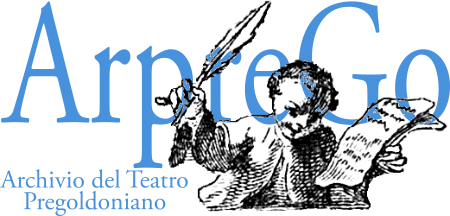

The project Archive of pregoldonian theatre (funded by the Ministry of Economics and Competitividad:
FFI2011-23663, 2012-2015, and FFI2014-53872-P, 2015-2018, as well as by the Ministry of Science, Innovation,
and Universities and by FEDER PGC2018-097031-B-I00, 2019-2022, and PID2023-148944NB-I00, 2024-2028) aims,
on the one hand, to identify all those Italian theatrical works, both known and unknown to Goldoni himself,
in which it is possible to detect characteristics useful in shedding light on nature of his reforms in all their
historic-artistic variety; and, on the other, to establish the dramatic texts (and paratexts) which were in
circulation at the time, both on theatrical circuits and in book form, and which, while not having a direct
influence on the Venetian’s works, formed part of the background to his growth and development.
The annotated critical editions of these works constitute the «Pregoldonian Library» (the volumes of which can
be downloaded free of charge in PDF format), while their analytical files form the «Database of Pregoldonian Theatre»,
also available for online consultation on this webpage. Moreover, the analysis of the repertoire staged at that time
will lead to the creation of the Database of the Italian Theatrical Repertoire (1650-1750). The project will also
include the musical contents of Gherardi’s edition of Comédie Italienne, whose scores will be published as
PDF and MP3 in Gherardi Musical Archive
